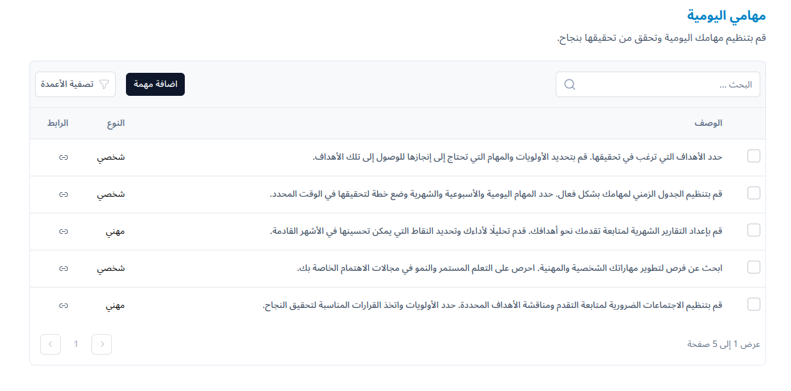
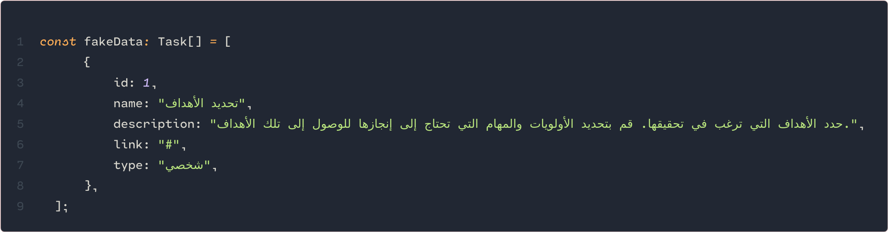
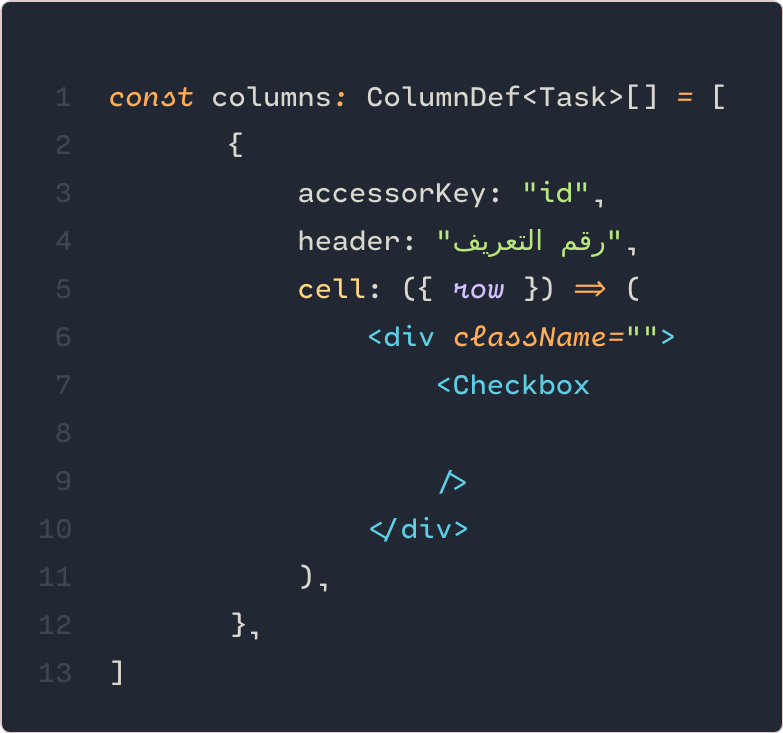
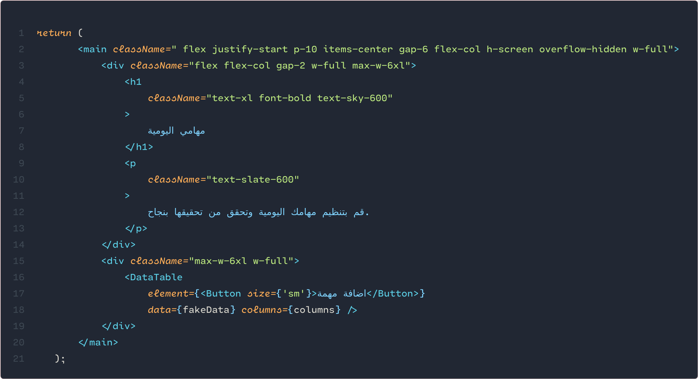

React Table Component with TanStack
===================================

Overview
--------
This project demonstrates a custom React table component using TanStack for managing table functionalities like sorting, filtering, pagination, and column visibility.

Features
--------
- Sorting: Click on column headers to sort data.
- Filtering: Use search inputs to filter data.
- Pagination: Navigate through pages of data.
- Column Visibility: Customize which columns to display.

Technologies Used
-----------------
- Next.js: Framework for React applications.
- TanStack: Library for building complex data grids and tables in React.
- React: JavaScript library for building user interfaces.
- Tailwind CSS: Utility-first CSS framework used for styling.

Setup
-----
1. Clone the repository:
   ```
   git clone https://github.com/redaezziani/data-table.git
   cd data-table
   ```

2. Install dependencies:
   ```
   npm install
   ```

3. Run the development server:
   ```
   npm run dev
   ```
   Open http://localhost:3000 to view it in the browser.

Usage
-----
1. Data Structure:
   - Define your data structure (Task interface in Home.tsx).
   - Provide sample data (fakeData array in Home.tsx).

2. Customization:
   - Modify columns and their configurations (columns array in Home.tsx).

3. Integration:
   - Integrate the DataTable component in your application where needed (Home.tsx).

4. Styling:
    - Customize the table styles using Tailwind CSS (core.tsx).
### Example
####  Data 


####  Columns


####  DataTable


License
-------
This project is licensed under the MIT License - see the LICENSE file for details.

Author
------
- Reda ezziani 

---
